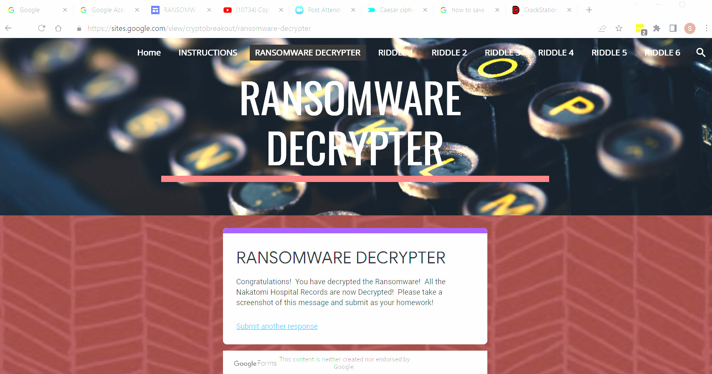

# CyberSecurity-SSILVER-HW10

Instructions:
In order to solve each riddle, you will need to apply cryptographic concepts covered in the past three lessons.
concepts will need to be applied.

Once the riddle has been solved, submit your answer on the bottom of each Riddle Page.

If you are correct, you will receive a key. Save this key in your notes.

Once you have collected all six keys, select the Ransomware Decrypted header on the website and enter all your keys.

If all the six keys are correct, the ransomware will be removed and the data will be decrypted.

Submission Requirements

You will need to submit a screenshot and all six keys as proof that the ransomware has been decrypted.

Good luck and act fast as the Nakatomi Patients are counting on you!

Riddle #1

        To solve Riddle #1, open the Caesar Cipher tool - enter ozcjmz and change the key to 8.  The Plaintext result is gruber and the first key is 6skd8s

Riddle #2

        To solve Riddle #2, you must convert Binary to Text.  Enter the Binary and convert 01000111 01100101 01101110 01101110 01100101 01110010 01101111 to Gennero and the second key is cy8snd2

Riddle #3

        To solve Riddle #3, you must open the terminal window, execute an openssl with the given -k and -iv.  The result gives you the third key ud6s98n

Riddle #4

        To solve Riddle #4, Jack would send an encrypted message to Jill utilizing her Public Key.  Jill would use her Private Key to decrypt Jack's message. They would need to utilize 12 Asymmetric (N*2) and 15 Symmetric (N*(N-1))/2 keys for the group of 6 to encrypt. In order for Tim to encrypt a message to one of his friends, he would utilize Alice's Public Key.  The result gave me the fourth key 7gsn3nd2

Riddle #5

        To solve Riddle #5, I copied the MD5 hash of 3b75cdd826a16f5bba0076690f644dc7 and utilized the CrackStation to crack it.  The result was and md5 of argyle.  Once entered into the Riddle, the result was my fifth key ajy39d2

Riddle #6

        To solve Riddle #6, I downloaded the Mary Had a Little Lamb image to my vm.  I ran steghide extract -sf mary-lamb.jpg.  The result was placed in the code_is_inside_this_file.txt.  I then figured out that the passphrase was ABC as the book that Mary was holding was called ABC.  I then ran cat code_is_inside_this_file.txt which provided me with the solution of mcclane.  I then enterred mcclane into the riddle which provided me with the final key 7skahd6

Ransomeware Decrypter

        Lastly, I enterred all of the keys found in Riddles 1-6 into the Ransomeware Decrypter which informed me that I successfully decrypted the Ransomware!

        

