# CyberSecurity-SSILVER-HW#08

Submission: "Its the End of the Assessment as We Know It, and I Feel Fine" 
•	List the steps and commands used to complete the tasks.
•	List any vulnerabilities discovered.
•	List any findings associated to a hacker.
•	Document the mitigation recommendations to protect against the discovered vulnerabilities.
•	Document the OSI layer where the findings were found.

        PHASE-1
•	fping < fping.txt
•	OSI – Network - Layer 3

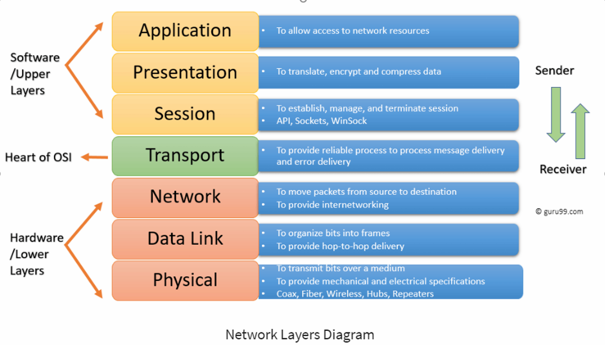

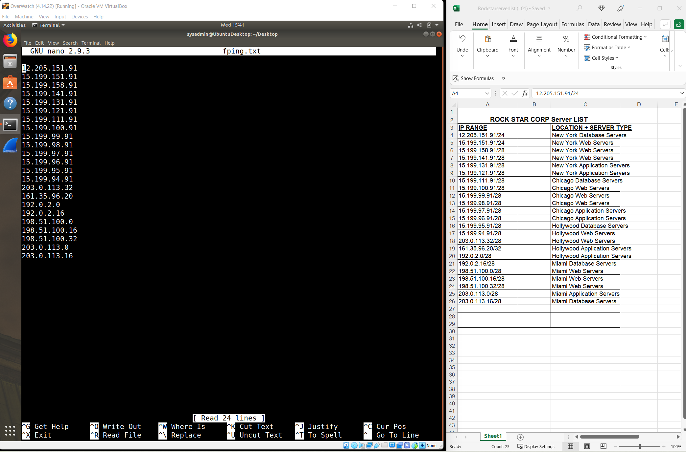

        PHASE-2
•	The cmd ran was nmap -sS 161.35.96.20
•	The transport layer 4 is used for SYN scans
•	Port 22 is open

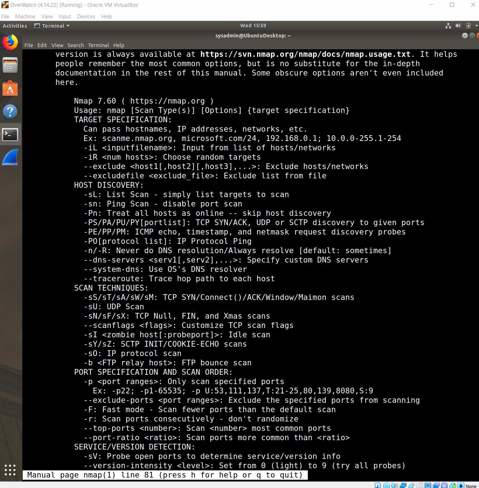

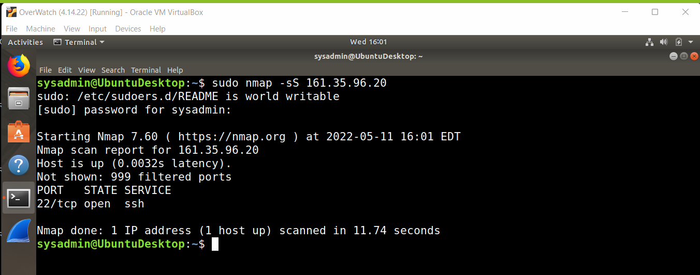

        PHASE-3
•	SSH’d into the server jimi hendrix – rollingstone.com
•	The cmd I ran was ssh jim@161.35.96.20
•	The OSI layer for DNS is Layer 7 (the Application Layer)
•	Reference https://stackoverflow.com/questions/21654632/at-what-layer-in-the-protocol-stack-does-dns-happen#:~:text=In%20OSI%20stack%20terms%2C%20DNS,which%20in%20turn%20use%20IP.

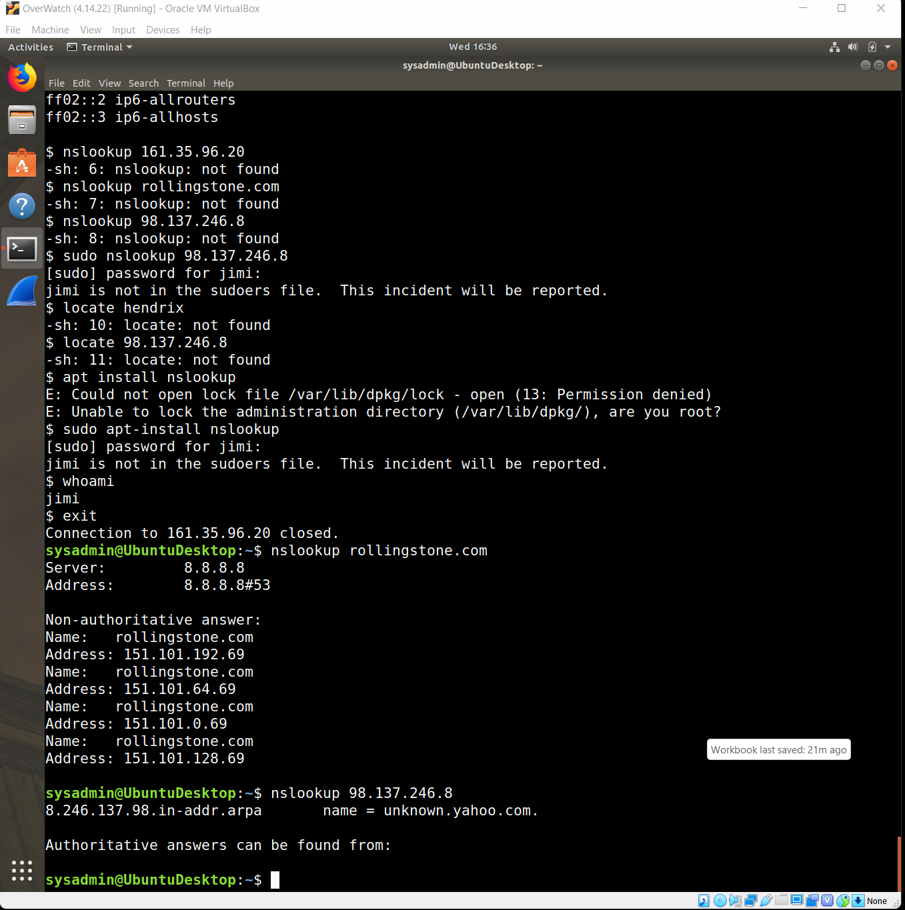

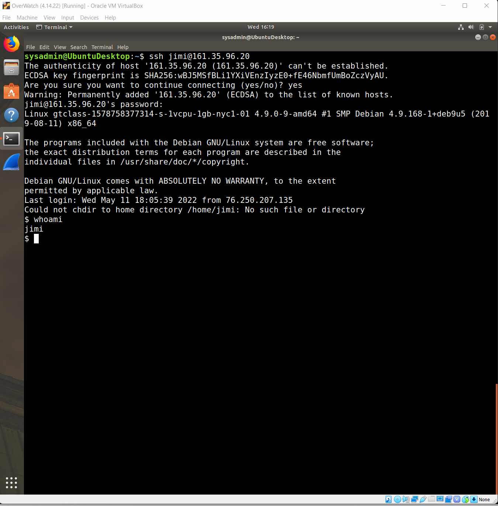

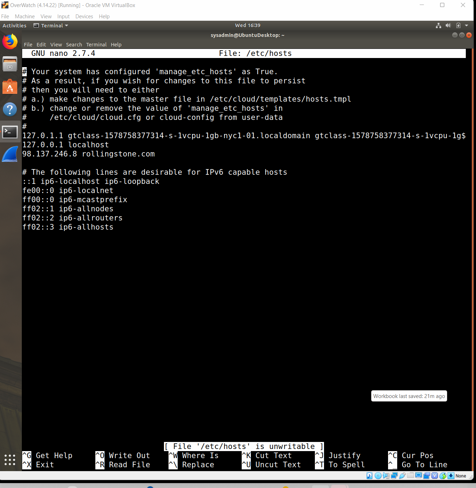

        PHASE-4
•	Arp poisoning attack – same ip’s, but different mac addresses
•	OSI Layer 2 = Mac/Arp poisoning

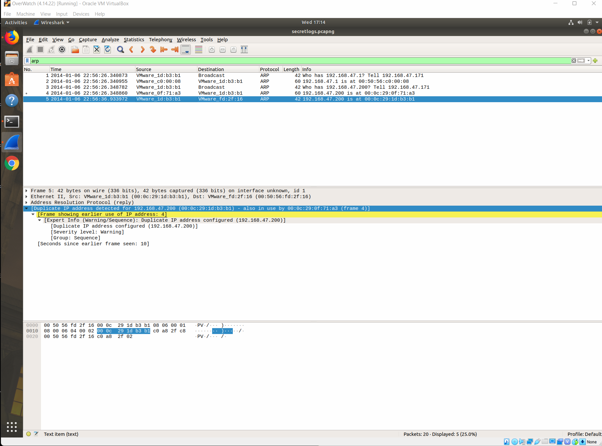

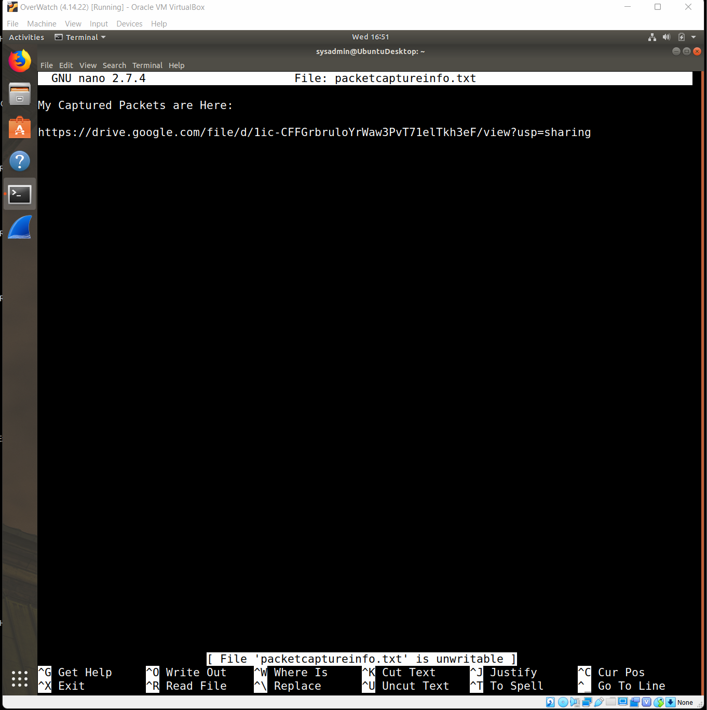

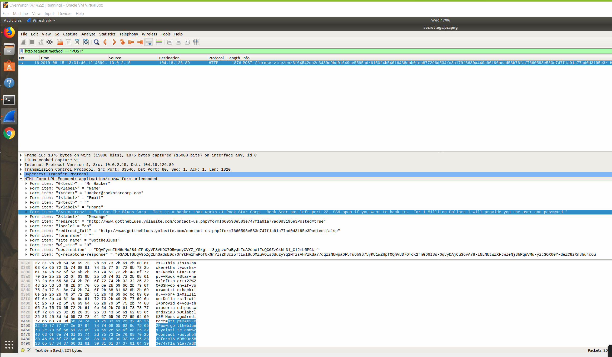

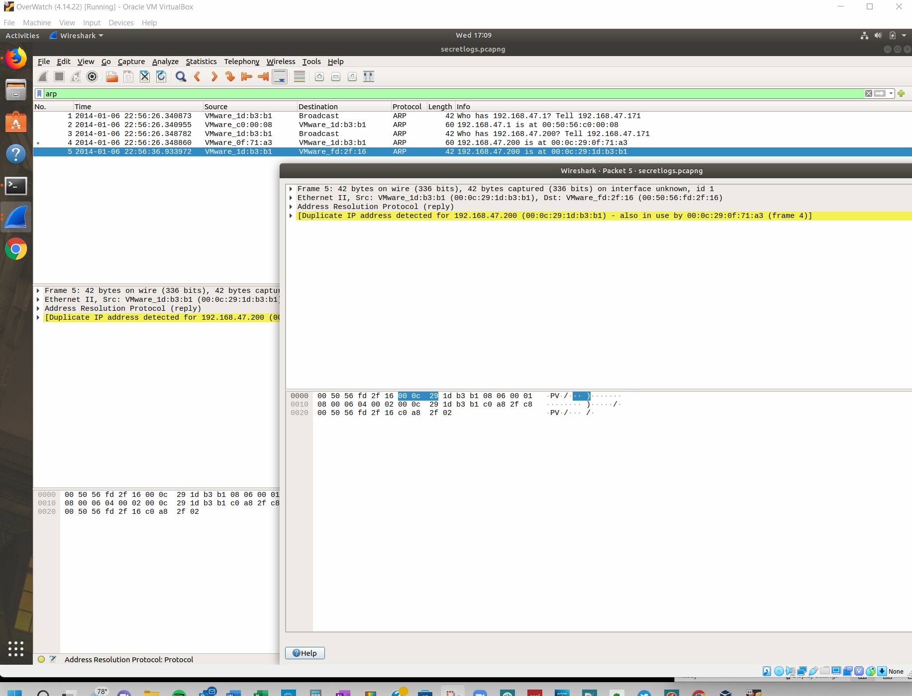

