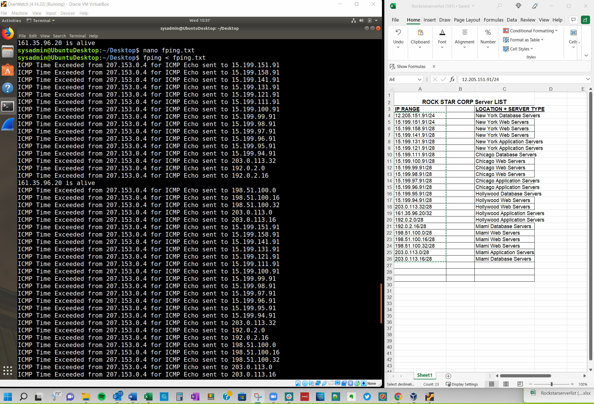

# CyberSecurity

            Hello World

Submission: "Its the End of the Assessment as We Know It, and I Feel Fine" 
•	List the steps and commands used to complete the tasks.
•	List any vulnerabilities discovered.
•	List any findings associated to a hacker.
•	Document the mitigation recommendations to protect against the discovered vulnerabilities.
•	Document the OSI layer where the findings were found.

        PHASE-1
•	fping < fping.txt
•	OSI – Network - Layer 3

        PHASE-2
•	The cmd ran was nmap -sS 161.35.96.20
•	The transport layer 4 is used for SYN scans
•	Port 22 is open
