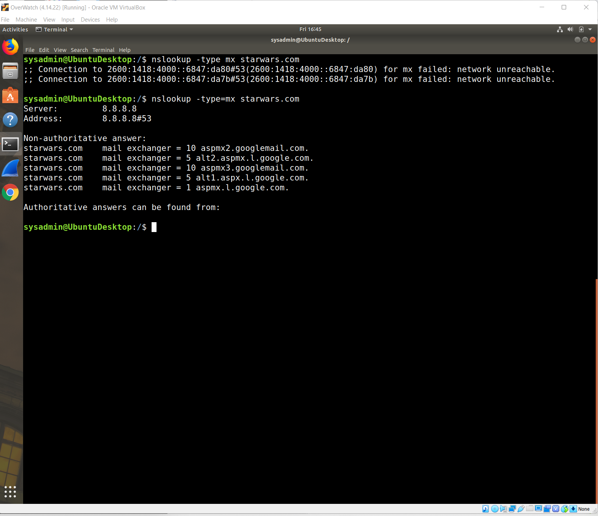
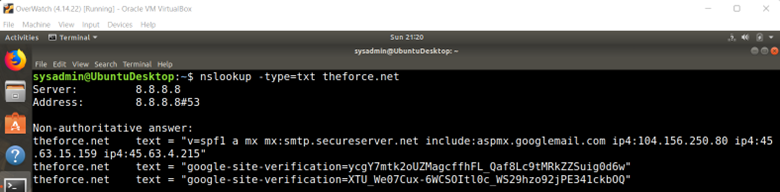
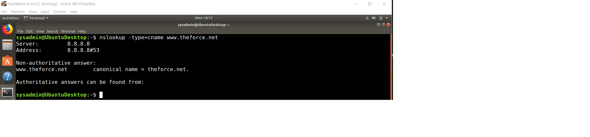

#Cybersecurity-SSILVER-HW9

    Mission 1
Issue: Due to the DoS attack, the Empire took down the Resistance's DNS and primary email servers.
•	The Resistance's network team was able to build and deploy a new DNS server and mail server.
•	The new primary mail server is asltx.l.google.com and the secondary should be asltx.2.google.com.
•	The Resistance (starwars.com) is able to send emails but unable to receive any.
Your mission:
•	Determine and document the mail servers for starwars.com using NSLOOKUP.

    Explain why the Resistance isn't receiving any emails:
o	The Resistance isn’t receiving any emails because the URLs listed for the e-mail exchange are incorrect

    Document what a corrected DNS record should be:
o	The corrected mail servers should be...
  
  asltx.l.google.com 
  
  asltx.2.google.com

    Mission 2
Issue: Now that you've addressed the mail servers, all emails are coming through. However, users are still reporting that they haven't received mail from the theforce.net alert bulletins.
•	Many of the alert bulletins are being blocked or going into spam folders.
•	This is probably due to the fact that theforce.net changed the IP address of their mail server to 45.23.176.21 while your network was down.
•	These alerts are critical to identify pending attacks from the Empire.

    Your mission:
•	Determine and document the SPF for theforce.net using NSLOOKUP.

nslookup -type=txt theforce.net 

•	    Explain why the Force's emails are going to spam.

The Force’s emails are going to the spam folder because the server’s IP address in the SPF record isn’t correct.

•	    Document what a corrected DNS record should be.

The corrected DNS record should have an IP address of 45.23.176.21

    Mission 3
Issue: You have successfully resolved all email issues and the resistance can now receive alert bulletins. However, the Resistance is unable to easily read the details of alert bulletins online.

•	They are supposed to be automatically redirected from their sub page of resistance.theforce.net to theforce.net.
Your mission:

•	Document how a CNAME should look by viewing the CNAME of www.theforce.net using NSLOOKUP:

