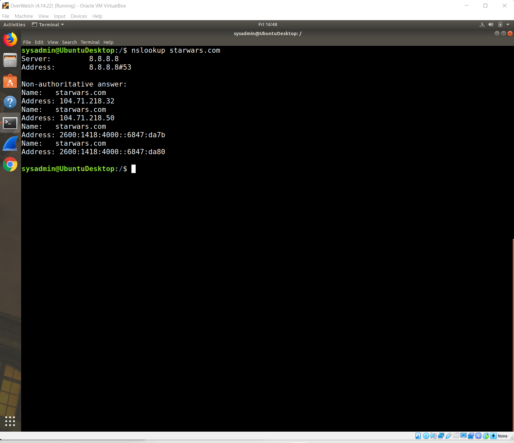

#Cybersecurity  

    Mission 1
Issue: Due to the DoS attack, the Empire took down the Resistance's DNS and primary email servers.
•	The Resistance's network team was able to build and deploy a new DNS server and mail server.
•	The new primary mail server is asltx.l.google.com and the secondary should be asltx.2.google.com.
•	The Resistance (starwars.com) is able to send emails but unable to receive any.
Your mission:
•	Determine and document the mail servers for starwars.com using NSLOOKUP.

    Explain why the Resistance isn't receiving any emails:
o	The Resistance isn’t receiving any emails because the URLs listed for the e-mail exchange are incorrect

    Document what a corrected DNS record should be:
o	The corrected mail servers should be...
	asltx.l.google.com 
	asltx.2.google.com
