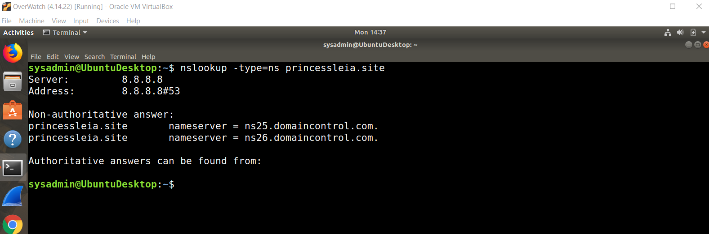

#Cybersecurity-SSILVER-HW9

    Mission 1
Issue: Due to the DoS attack, the Empire took down the Resistance's DNS and primary email servers.
•	The Resistance's network team was able to build and deploy a new DNS server and mail server.
•	The new primary mail server is asltx.l.google.com and the secondary should be asltx.2.google.com.
•	The Resistance (starwars.com) is able to send emails but unable to receive any.
Your mission:
•	Determine and document the mail servers for starwars.com using NSLOOKUP.

    Explain why the Resistance isn't receiving any emails:
o	The Resistance isn’t receiving any emails because the URLs listed for the e-mail exchange are incorrect

    Document what a corrected DNS record should be:
o	The corrected mail servers should be...
  
  asltx.l.google.com 
  
  asltx.2.google.com

    Mission 2
Issue: Now that you've addressed the mail servers, all emails are coming through. However, users are still reporting that they haven't received mail from the theforce.net alert bulletins.
•	Many of the alert bulletins are being blocked or going into spam folders.
•	This is probably due to the fact that theforce.net changed the IP address of their mail server to 45.23.176.21 while your network was down.
•	These alerts are critical to identify pending attacks from the Empire.

    Your mission (Mission 2 cont.):
•	Determine and document the SPF for theforce.net using NSLOOKUP.

  nslookup -type=txt theforce.net 

•	    Explain why the Force's emails are going to spam.

The Force’s emails are going to the spam folder because the server’s IP address in the SPF record isn’t correct.

•	    Document what a corrected DNS record should be.

  The corrected DNS record should have an IP address of 45.23.176.21

    Mission 3
Issue: You have successfully resolved all email issues and the resistance can now receive alert bulletins. However, the Resistance is unable to easily read the details of alert bulletins online.

•	They are supposed to be automatically redirected from their sub page of resistance.theforce.net to theforce.net.
Your mission:

•	Document how a CNAME should look by viewing the CNAME of www.theforce.net using NSLOOKUP:

•	Explain why the sub page of resistance.theforce.net isn't redirecting to theforce.net.

  The canonical name for www.theforce.net is incorrectly listed as theforce.net, but instead should be listed as resistance.theforce.net.

•	Document what a corrected DNS record should be.

  The DNS record should be corrected to resistance.theforce.net instead of theforce.net

    Mission 4
Issue: During the attack, it was determined that the Empire also took down the primary DNS server of princessleia.site.
•	Fortunately, the DNS server for princessleia.site is backed up and functioning.
•	However, the Resistance was unable to access this important site during the attacks and now they need you to prevent this from happening again.
•	The Resistance's networking team provided you with a backup DNS server of: ns2.galaxybackup.com.
Your mission:

•	Confirm the DNS records for princessleia.site.

•	Document how you would fix the DNS record to prevent this issue from happening again.

  I would add the website ns2.galaxybackup.com for the backup DNS server as it's currently not listed

    Mission 5
Issue: The network traffic from the planet of Batuu to the planet of Jedha is very slow.
•	You have been provided a network map with a list of planets connected between Batuu and Jedha.
•	It has been determined that the slowness is due to the Empire attacking Planet N.
Your Mission:

•	View the Galaxy Network Map and determine the OSPF shortest path from Batuu to Jedha.
•	Confirm your path doesn't include Planet N in its route.
•	Document this shortest path so it can be used by the Resistance to develop a static route to improve the traffic.
  The shortest path from Batuu to Jehda is: 

  Batuu - D - C - E - I - L - Q - T - V - Jedha 

  The path doesn't include Planet N in its route

